# 🌍 NGO Connect - Volunteer & NGO Management Platform

<p align="center">
  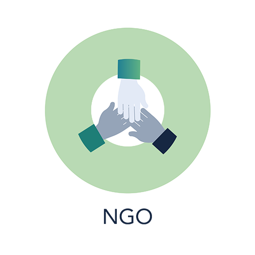
</p>

<p align="center">
  <strong>Connecting Volunteers with NGOs to Create Social Impact</strong>
</p>

<p align="center">
  
  
  
  
</p>

---

## 📱 About The App

**NGO Connect** is a comprehensive Flutter-based mobile application designed to bridge the gap between Non-Governmental Organizations (NGOs) and volunteers. The platform facilitates seamless collaboration, donation management, campaign coordination, and community building to maximize social impact.

The app serves two primary user types:
- **NGOs** - Organizations looking to manage volunteers, run campaigns, and receive donations
- **Volunteers** - Individuals wanting to contribute their time, skills, and resources to worthy causes

---

## ✨ Key Features

### 🏢 For NGOs

| Feature | Description |
|---------|-------------|
| **Dashboard** | Comprehensive overview of campaigns, donations, volunteers, and activities |
| **Campaign Management** | Create, edit, and manage fundraising campaigns with goals and timelines |
| **Volunteer Management** | View, approve, and coordinate with registered volunteers |
| **Donation Tracking** | Monitor incoming donations and generate reports |
| **SOS Alerts** | Send emergency alerts to volunteers for urgent needs |
| **Quick Tasks** | Create and assign quick tasks to volunteers |
| **Reports & Analytics** | Generate detailed reports with charts and insights |
| **Marketplace** | Share and request resources from other NGOs |
| **Notifications** | Real-time push notifications for all activities |
| **Public Profile** | Showcase your NGO's work and impact to the world |

### 🙋 For Volunteers

| Feature | Description |
|---------|-------------|
| **Discover NGOs** | Browse and follow verified NGOs |
| **Join Campaigns** | Participate in active campaigns and track progress |
| **Donate** | Make donations via blockchain-enabled secure transactions |
| **Volunteer Opportunities** | Find and apply for volunteering opportunities |
| **Community** | Join communities, participate in discussions, and attend events |
| **Emergency Response** | Respond to SOS alerts from NGOs |
| **Impact Tracking** | View your contribution history and impact stats |
| **Event Calendar** | Keep track of upcoming events and activities |
| **Government Schemes** | Access information about relevant government programs |
| **Ask Experts** | Connect with experts for guidance and support |

### 🌐 Shared Features

- **🔐 Secure Authentication** - Email/password and Google Sign-In
- **📍 Location Services** - Google Maps integration for events and NGO locations
- **📸 Media Support** - Image and video upload capabilities
- **🔔 Push Notifications** - Real-time updates even when app is closed
- **💬 Community Posts** - Share updates, success stories, and engage with others
- **📊 CSR Integration** - Corporate Social Responsibility partnerships
- **🔄 Needs Forecasting** - AI-powered prediction for resource needs

---

## 🛠️ Tech Stack

| Technology | Purpose |
|------------|---------|
| **Flutter** | Cross-platform mobile development |
| **Dart** | Programming language |
| **Firebase Auth** | User authentication |
| **Cloud Firestore** | Real-time NoSQL database |
| **Firebase Storage** | File and media storage |
| **Firebase Messaging** | Push notifications |
| **Google Maps Flutter** | Maps and location services |
| **FL Chart** | Data visualization |
| **Geolocator** | GPS and location tracking |

---

## 📁 Project Structure

```
lib/
├── app/                      # App-level composition (bootstrap, routing)
├── core/                     # Technical foundation (theme, config, network, shared services)
├── shared/                   # Cross-feature reusable models and widgets
├── features/                 # Feature-first business modules
│   ├── auth/
│   ├── ngo/
│   ├── volunteer/
│   ├── admin/
│   ├── donations/
│   ├── campaigns/
│   ├── community/
│   ├── emergency/
│   ├── opportunities/
│   ├── notifications/
│   ├── home/
│   └── profile/
├── l10n/                     # Localizations
├── firebase_options.dart     # Firebase configuration
└── main.dart                 # App entry point
```

Current status: migration is incremental. Legacy folders (`screens`, `services`, `utils`, `widgets`) are still present and being moved feature-by-feature to avoid breaking changes.

See `docs/architecture/FOLDER_STRUCTURE.md` for the complete migration map and team conventions.

---

## 🚀 Getting Started

### Prerequisites

- Flutter SDK 3.8.1 or higher
- Dart 3.0 or higher
- Android Studio / VS Code
- Firebase account
- Google Maps API key

### Installation

1. **Clone the repository**
   ```bash

   git clone https://github.com/RANANUJ/ngo_app.git

   cd ngo_app


2. **Install dependencies**
   ```bash
   flutter pub get
   ```

3. **Configure Firebase**

   - Enable Authentication, Firestore, Storage, and Cloud Messaging

4. **Configure Google Maps**

   - Add the API key to:


5. **Run the app**
   ```bash
   flutter run


## 📱 Screenshots

<div align="center">

### NGO Dashboard

<p align="center">
  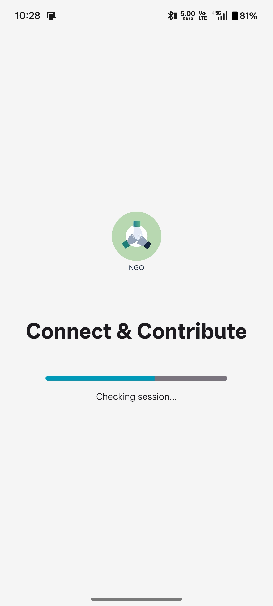
  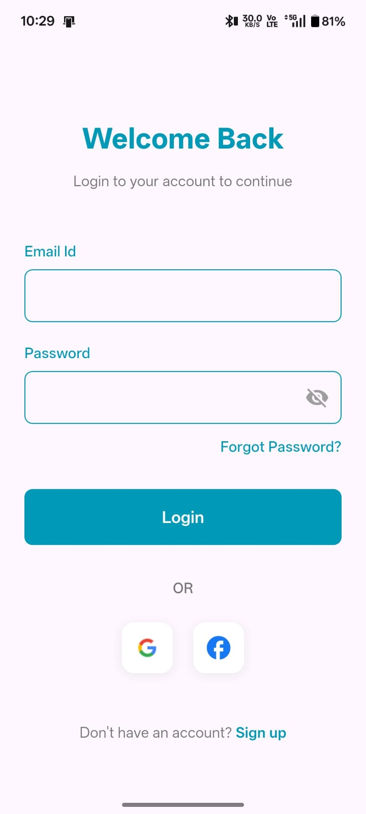
  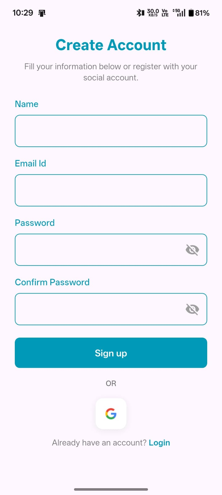
  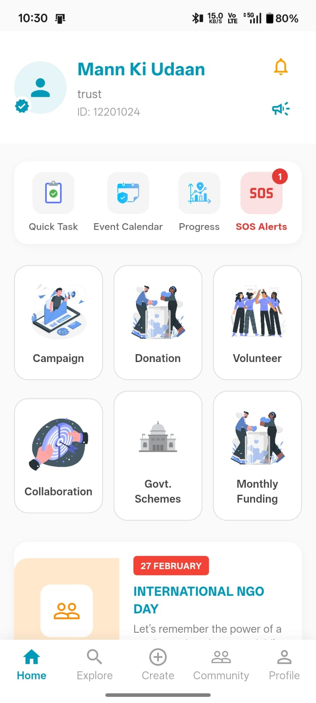
  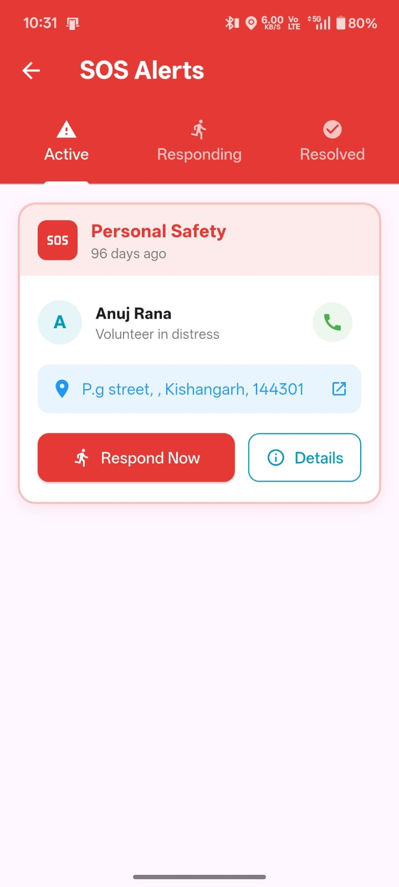
  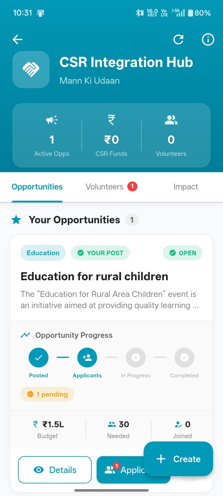
  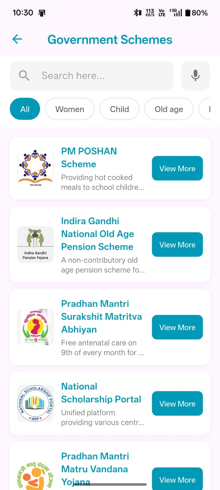
  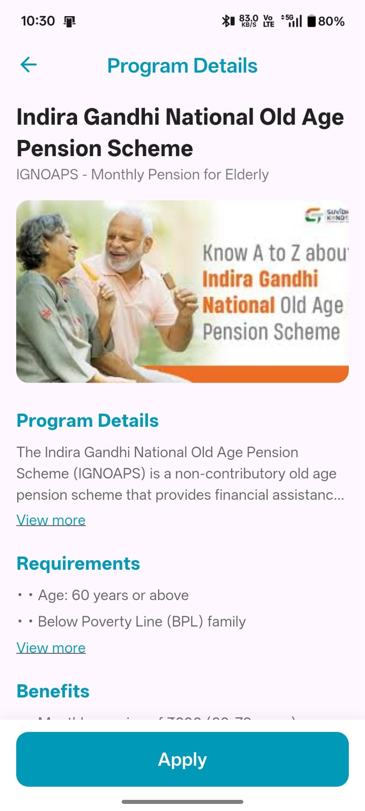
</p>

---

### Volunteer Dashboard

<p align="center">
  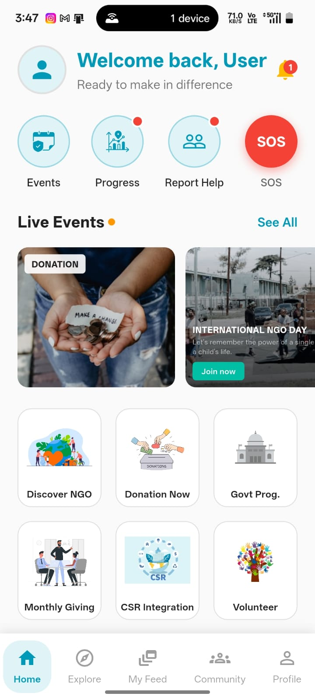
  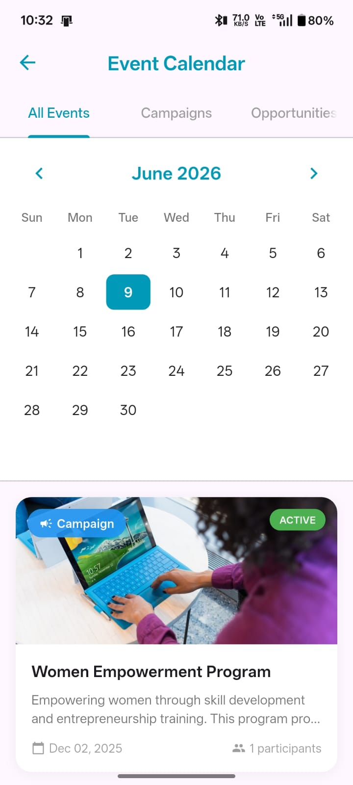
  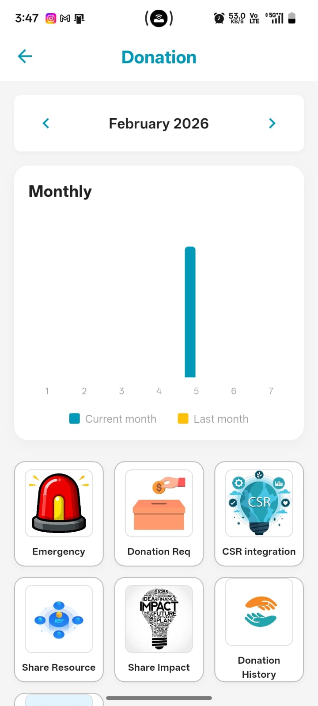
  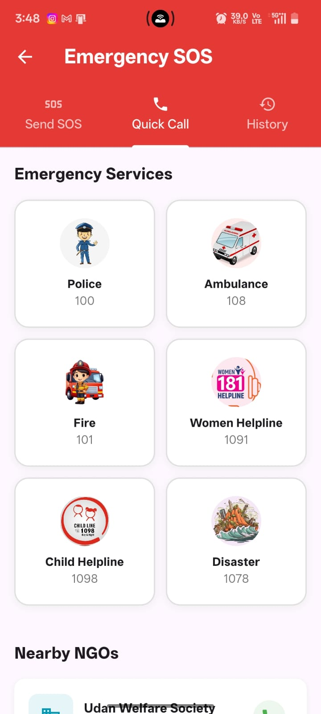
  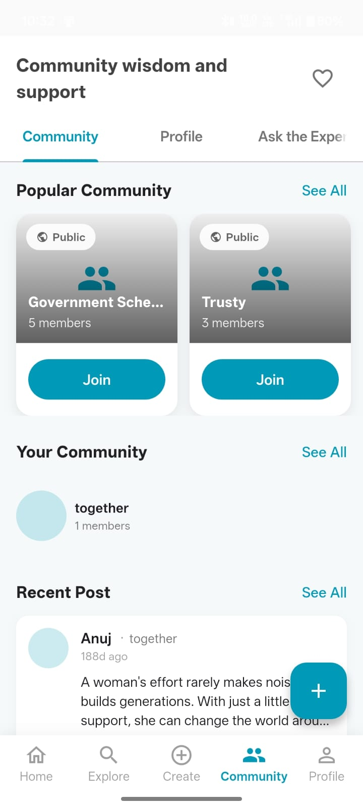
  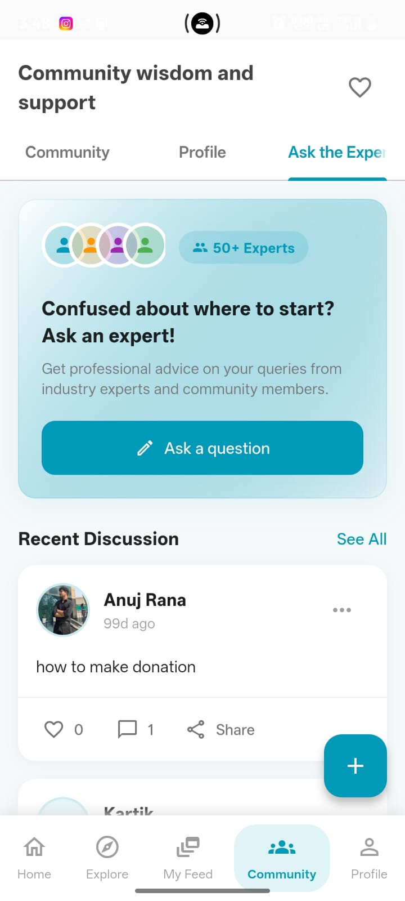
  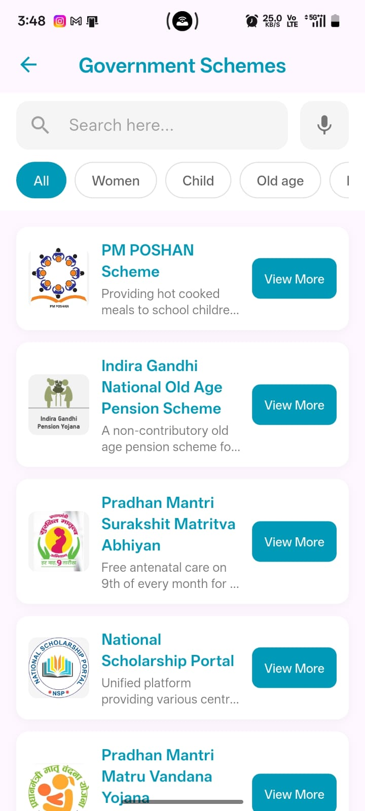
</p>

</div>


---

## 🔐 Firebase Security Rules

The app uses comprehensive Firestore security rules to protect user data. See `firestore.rules` for the complete ruleset.

---

## 🔔 Push Notifications

The app supports:
- **Foreground notifications** - Displayed while app is open

Notification channels include:
- SOS Alerts (High Priority)
- Donations
- Campaign Updates
- General Notifications

---

## 🤝 Contributing

Contributions are welcome! Please feel free to submit a Pull Request.

1. Fork the repository
2. Create your feature branch (`git checkout -b feature/AmazingFeature`)
3. Commit your changes (`git commit -m 'Add some AmazingFeature'`)
4. Push to the branch (`git push origin feature/AmazingFeature`)
5. Open a Pull Request

---

## 📄 License

This project is licensed under the MIT License - see the [LICENSE](LICENSE) file for details.

---

## 👨‍💻 Author

**RANANUJ**

- GitHub: [@RANANUJ](https://github.com/RANANUJ)

---

## 🙏 Acknowledgments

- Flutter team for the amazing framework
- Firebase for the robust backend services
- All contributors and supporters of this project

---

<p align="center">
  Made with ❤️ for Social Good
</p>

